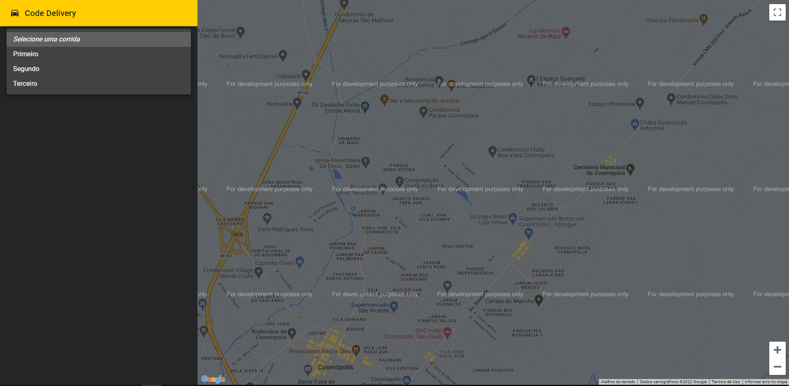
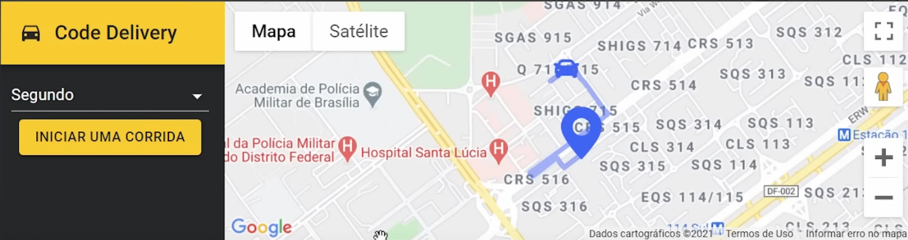
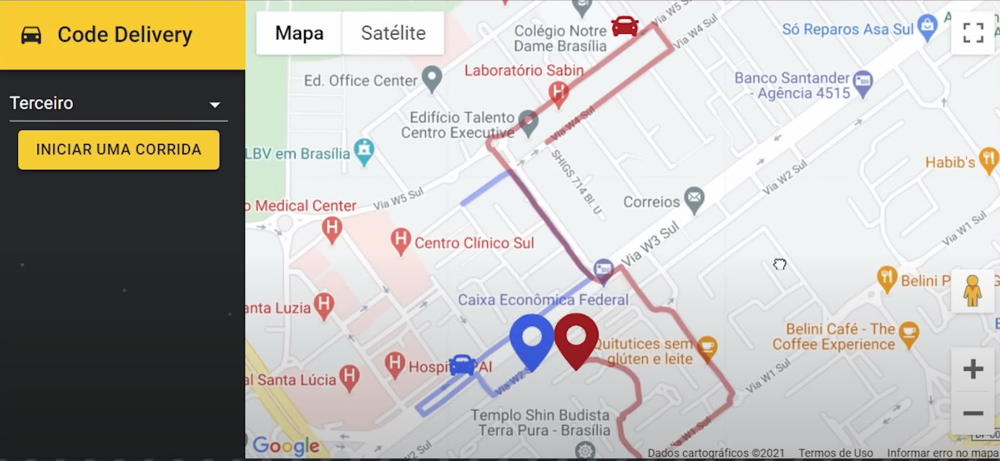
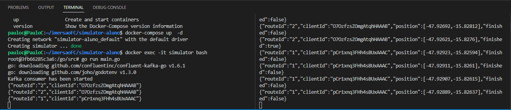

# CODE DELIVERY

Aplicação de rastreamento em tempo real.

### Explicação do sistema

- Na página principal é mostrado os endereços possiveis para o rastreio   

- Quando pressionado o botão de começar o frontend envia uma requisição para o backend 

- O backend dispara uma mensagem para o kafka

- Quando o kafka recebe dispara o simulator que envia as posições para o backend

- O backend manda para o frontend os dados através de uma conexão web socket

### Tela principal


### Rastreio 1 carro


### Rastreio 2 carros


### Consumer Kafka


# 🚀 Começando

Essas instruções permitirão que você obtenha uma cópia do projeto em operação na sua máquina local para fins de desenvolvimento e teste.

## 📋 Pré-requisitos

- wls2 no windows
- docker
- npm / yarn
- cadastro no googlecloud

## 🔧 Instalação
### :warning::warning: **A pasta imgs**: é para guardar as imagens usadas no readme.md! Apagar ela depois do clone :warning::warning:

``` bash
## clonar repositório
git clone https://github.com/PauloCSantos/code-delivery.git

# no diretorio simulator-aluno

## habilitar o côntainer do kafka
cd simulator-aluno/.docker/kafka
docker-compose up -d 
docker exec -it kafka_kafka_1 bash
kafka-console-consumer --bootstrap-server=localhost:9092 --topic=route.new-position --group=terminal

## habilitar o côntainer do go
docker-compose up -d 
docker exec -it simulator bash
go run main.go

# no diretorio nest-api

## entrar na pasta do projeto no terminal
cd nest-api
docker-compose up -d
aguardar

# no diretorio react-frontend

## entrar na pasta do projeto no terminal
cd react-frontend
docker-compose up -d
acessar o endereço do terminal


##OBS
Para utilizar o mapa do google é necessario uma key da api e habilitar a fatura do google cloud

.env nest-api
MONGO_DSN=mongodb://root:root@db/nest?authSource=admin
KAFKA_CLIENT_ID=code-delivery
KAFKA_BROKER=host.docker.internal:9094
KAFKA_CONSUMER_GROUP_ID=

KAFKA_SASL_USERNAME=
KAFKA_SASL_PASSWORD=

.env react-frontend
REACT_APP_API_URL=http://localhost:3000
REACT_APP_GOOGLE_API_KEY=chave da api do google

.env simulator
KafkaReadTopic=route.new-direction
KafkaProduceTopic=route.new-position
KafkaBootstrapServers=host.docker.internal:9094
KafkaConsumerGroupId=simulator
```

## 🛠️ Construído com

- Docker
- Go
- Kafka
- NestJs
- React
- MaterialUI

## ✒️ Autor

* **Paulo C Santos** - [Linkedin](https://www.linkedin.com/in/paulocsantos1995/)

## 🖐️ Agradecimento

Agradeço a equipe FullCycle, o conteudo pratico foi sensacional usar o wsl com o docker foi uma experiencia unica. As lives a noite 
também trouxe muito aprendizado de como as grandes empresas estão funcionando

- Link da FullCycle: https://fullcycle.com.br/
